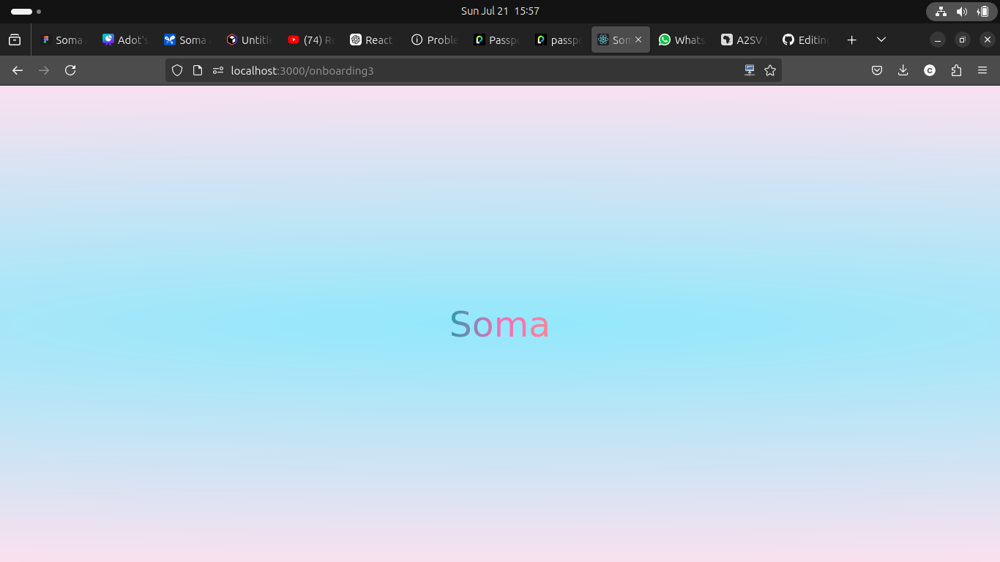
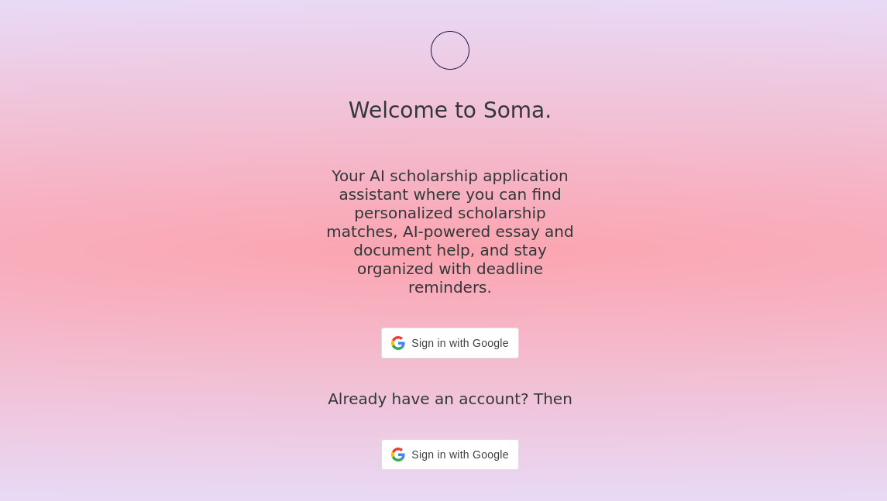
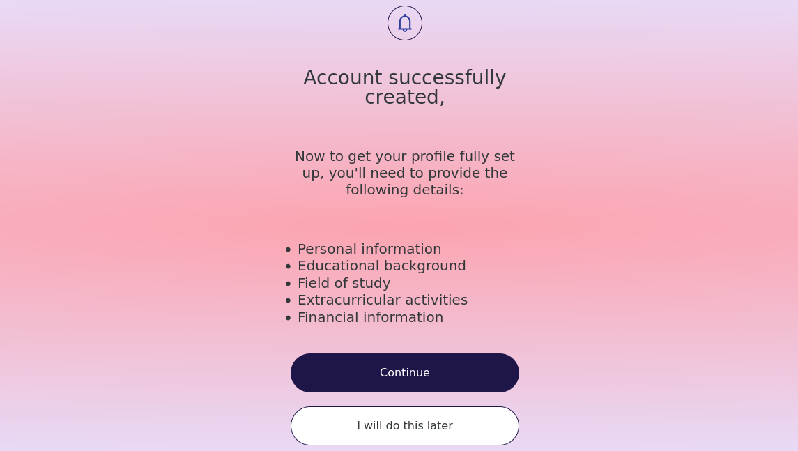
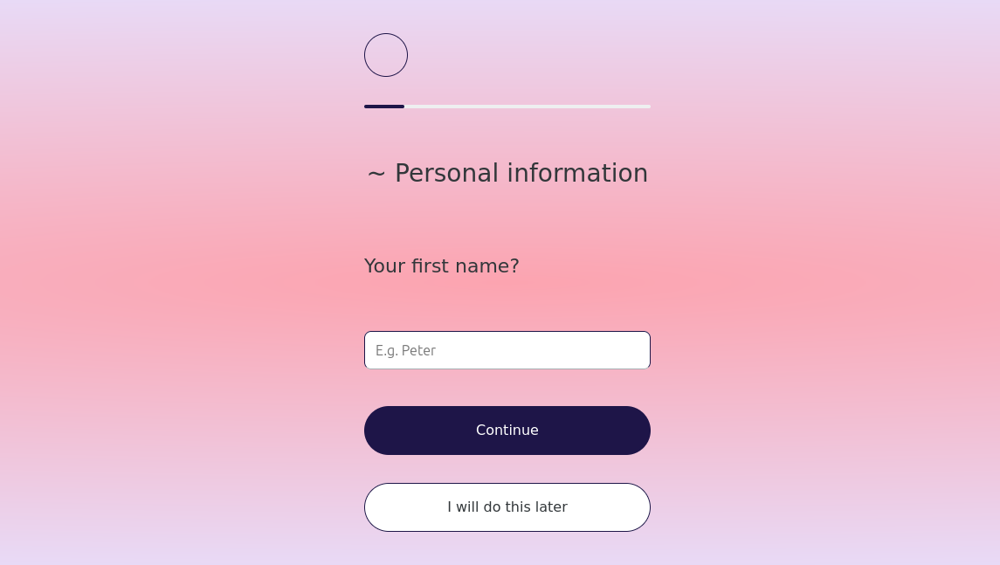

# Soma AI - Scholarship Matching and Application Assistance Platform

Welcome to the Soma AI GitHub repository! Soma AI is an AI-powered scholarship application assistant designed to help students find and apply for scholarships that fit their profiles. This repository contains the source code and development history of the Soma AI platform.

## Features

- Personalized scholarship matches
- AI-powered essay and document help
- Deadline reminders
- Easy sign-up and sign-in with Google

## Screenshots

### Onboarding Screen



The onboarding screen welcomes users to Soma and provides an overview of the app's features.

### Signup With Google



### Account Successfully Created



After signing up, users are informed that their account has been successfully created and are provided with a list of details they need to complete their profile.

### Personal Information



Users are prompted to enter their personal information to help tailor their scholarship search and assistance.

## Structure

The repository is structured as follows:

- **`backend/`**: This directory contains the backend code for Soma AI, including the API endpoints, database models, and business logic. The backend is implemented in Python using the Django framework to handle user profiles, scholarship data scraping, and matching algorithms.

- **`frontend/`**: In this directory, you will find the frontend code for Soma AI, implemented using JavaScript, React, and Redux. This directory also includes the HTML, CSS, and JavaScript files that define the user interface, allowing students to interact with the platform seamlessly.

- **`models/`**: This directory houses the AI/ML models used by Soma AI to personalize scholarship matching and assist with application document creation and editing. These models are built using Python-based AI/ML libraries and play a critical role in enhancing user experience and effectiveness in scholarship applications.

## How AI Models Are Solving the Problem

Soma AI leverages advanced AI models to provide personalized scholarship matching and AI-powered writing assistance:

- **Personalized Scholarship Matching**: The AI models analyze user profiles, including academic history, interests, and financial needs, to match them with the most relevant scholarships. The models continuously learn from user interactions to improve the accuracy of matches over time.

- **AI-Powered Writing Assistance**: Soma AI includes AI-driven tools that assist users in creating and editing documents required for scholarship applications. These tools help with drafting personal statements, essays, and recommendation letters, while ensuring the content is clear, concise, and aligned with scholarship requirements.

By integrating these AI models, Soma AI simplifies the scholarship application process, making it more efficient and increasing the chances of success for students.

## Getting Started

To get started with the development version of Soma, follow these steps:

1. Clone the repository:
    ```bash
    git clone https://github.com/your-username/soma.git
    cd soma
    ```

2. Install the necessary dependencies for both the frontend and backend:
    ```bash
    # For the frontend
    cd frontend
    npm install

    # For the backend
    cd ../backend
    npm install
    ```

3. Set up your environment variables:
    ```bash
    # Create a .env file in the backend directory and add your Google OAuth credentials
    GOOGLE_CLIENT_ID=your-google-client-id
    GOOGLE_CLIENT_SECRET=your-google-client-secret
    ```

4. Start the development servers:
    ```bash
    # Start the backend server
    cd backend
    npm run dev

    # Start the frontend server
    cd ../frontend
    npm start
    ```

## Technologies Used

- React
- Node.js
- Express
- MongoDB
- Passport.js for Google OAuth

## Contributing

We welcome contributions to Soma! If you have any suggestions or improvements, feel free to open an issue or submit a pull request.

## License

Soma AI is licensed under the MIT License. Please refer to the [LICENSE](LICENSE) file for more information.

---

This project was created for a hackathon and is under active development. We appreciate your feedback and support!

